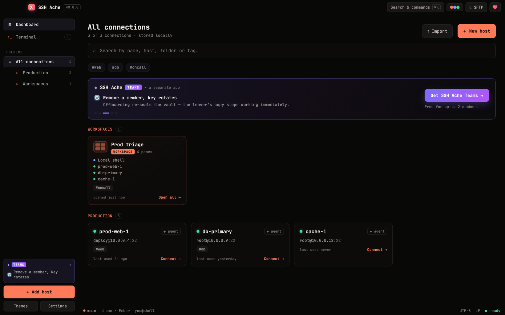

<p align="center"></p>

<p align="center">A desktop SSH client with a clean terminal UI — connections, SFTP, port forwarding, and an approval-gated AI agent bridge, with your data kept on your machine and encrypted at rest.</p>

<p align="center">
  <a href="https://github.com/SSH-Ache/ssh-ache/releases"></a>
  
  
  
</p>

<p align="center">
  <a href="https://github.com/SSH-Ache/ssh-ache/releases">Releases</a> ·
  <a href="./docs/MCP.md">AI agent (MCP)</a> ·
  <a href="https://github.com/SSH-Ache/ssh-ache/issues/new">Report a bug</a>
</p>

> **Community edition.** A fully local, open-source SSH client — everything runs on your machine, nothing is uploaded, no account required. **SSH Ache Teams**, an optional way to share connections with your team end-to-end encrypted, is a separate product.

<p align="center"></p>

## Features

- 💻 **Real terminal** — full SSH sessions (russh + xterm.js), tabbed, with splittable panes, plus local shell tabs.
- 🗂️ **Host vault** — saved hosts organised in folders with colours and favourites; secrets stored in the OS keychain; copy a ready-to-run `ssh` command for any host.
- 🔑 **Key Vault** — save named SSH private keys once (encrypted in the OS keychain) and reuse them across connections.
- 🔐 **Host-key verification** — first-connect fingerprint confirmation, `known_hosts` tracking, and a hard refusal with a warning if a host key ever changes (MITM protection).
- 📁 **SFTP browser** — dual-pane local/remote navigation with drag-and-drop transfer of multiple files and whole folders, a replace/skip conflict prompt, and remote create-folder / rename / delete.
- 🔀 **Port forwarding & SOCKS** — local (`-L`), remote (`-R`), and a dynamic SOCKS5 proxy (`-D`), all over the SSH connection. Keepalive keeps idle tunnels alive.
- 🛫 **Jump hosts (ProxyJump)** — reach a host through a saved bastion; the jump host's key is verified too.
- 📥 **Import `~/.ssh/config`** — pull existing hosts (and their ProxyJump links) straight into the vault.
- 📡 **Broadcast input** — type once, send to every split pane in a tab (cluster-ssh).
- 🔎 **Find & on-connect commands** — `⌘F` searches the terminal scrollback; each host can run a saved command (e.g. `tmux attach`) the moment the shell opens.
- 🎨 **Themes & settings** — terminal themes with live font size, cursor, and scrollback controls.
- 💾 **Encrypted backup** — export and import your hosts and secrets as a password-encrypted file (PBKDF2 → AES-256-GCM).
- ⏳ **Idle vault lock** — optional passphrase lock after a period of inactivity.
- 🤖 **AI agent access (MCP)** — an optional, off-by-default MCP server bound to localhost behind a bearer token, with per-host opt-in and per-command in-app approval; secrets never reach the agent. See [docs/MCP.md](./docs/MCP.md).
- 🖥️ **Cross-platform** — built with Tauri 2 (Rust) for macOS, Windows, and Linux.

## Install

### Direct download

Grab the latest platform build — `.dmg` (macOS), `.msi` (Windows), or `.AppImage` / `.deb` (Linux) — from the [Releases](https://github.com/SSH-Ache/ssh-ache/releases) page.

> macOS may block the first launch ("unidentified developer") because the build isn't notarised — right-click the app → **Open** to run it anyway.

### Build from source

```sh
npm install
npm run tauri build
```

Building from source requires Rust and the Tauri toolchain. See the [Tauri prerequisites](https://tauri.app/start/prerequisites/) for platform-specific setup.

## Security

- **Host-key verification** — fingerprints are confirmed on first connect and tracked in `known_hosts`; if a host key ever changes, the connection is refused with a warning to guard against man-in-the-middle attacks.
- **OS-keychain secret storage** — passwords and keys live in the operating system keychain, not in plaintext config.
- **Encrypted backups** — exported hosts and secrets are sealed with PBKDF2 key derivation and AES-256-GCM encryption.
- **Approval-gated AI access** — the MCP server is off by default, bound to `127.0.0.1` behind a random bearer token, default-deny per host, and requires explicit in-app approval for every command; secrets are never exposed to the agent. Details in [docs/MCP.md](./docs/MCP.md).

Your data stays on your machine, encrypted at rest.

## Tech stack

Tauri 2 (Rust backend) · React + xterm.js (frontend) · russh / russh-sftp · portable-pty · OS keychain (keyring).

## License

Licensed under the [Apache License 2.0](./LICENSE) — free to use, modify, and distribute, including commercially. See [NOTICE](./NOTICE) for attribution.

## Support

If SSH Ache saves you time, you can [buy me a coffee ☕](https://www.patreon.com/cw/tanvirmahin24).

## Author

**Noor Ajmir Tanvir**

- Website — [tanvirmahin.com](https://tanvirmahin.com)
- GitHub — [@TanvirMahin24](https://github.com/TanvirMahin24)
- Email — [tanvirmahin24@gmail.com](mailto:tanvirmahin24@gmail.com)
